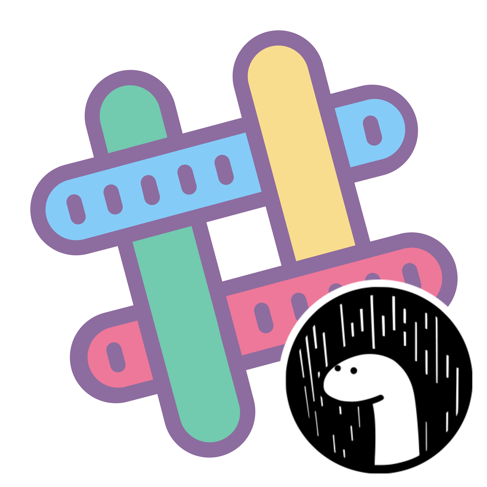

    
    <h1>Deno Slack SDK</h1>
    

        <b>Deno ports for <a href="https://github.com/slackapi/node-slack-sdk">node-slack-sdk</a> and <a href="https://github.com/slackapi/bolt">bolt</a></b>
    

    

        
        
        
    

    

        <b><a href="https://github.com/KhushrajRathod/Blueprint">View Blueprint</a> -- <a href="https://github.com/KhushrajRathod/DenoModules">Other deno modules</a></b>
    

     
     
     

# Table of Contents

- [Bolt](#bolt) - Abstraction over the Slack SDK

- [Slack SDK](#slack-sdk)
    - [Web API](#web-api)
    - [Socket Mode](#socket-mode)
    - [OAuth](#oauth)
    - [RTM API](#rtm-api)
    - [Webhook](#webhook)

- [Helpers](#helpers)
    - [Logger](#logger)
    - [Types](#types)

- [Deprecated](#deprecated)
    - [Interactive messages](#interactive-messages) - Use Bolt instead
    - [Events API](#events-api) - Use Bolt instead

# Bolt

    
    
    
    
    
    

<b><a href="https://github.com/KhushrajRathod/slack-bolt">View on GitHub</a></b> -- <b><a href="https://deno.land/x/slack_bolt">View on deno.land</a></b>

- Description: TypeScript framework to build Slack apps in a flash with the latest platform features ⚡️
- Node Equivalent: [@slack/bolt](https://www.npmjs.com/package/@slack/bolt)

# Slack SDK

## Web API

    
    
    
    
    
    

<b><a href="https://github.com/KhushrajRathod/slack-web-api">View on GitHub</a></b> -- <b><a href="https://deno.land/x/slack_web_api">View on deno.land</a></b>

- Description: Simple, convenient, and configurable HTTP client for making requests to Slack’s [Web API](https://api.slack.com/web)
- Node Equivalent: [@slack/web-api](https://www.npmjs.com/package/@slack/web-api)

## Socket Mode

    
    
    
    
    
    

<b><a href="https://github.com/KhushrajRathod/slack-socket-mode">View on GitHub</a></b> -- <b><a href="https://deno.land/x/slack_socket_mode">View on deno.land</a></b>

- Description: Recieve events from Slack's [Events API](https://api.slack.com/apis/connections/events-api) over a WebSocket connection
- Node Equivalent: [@slack/socket-mode](https://www.npmjs.com/package/@slack/socket-mode)

## OAuth

    
    
    
    
    
    

<b><a href="https://github.com/KhushrajRathod/slack-oauth">View on GitHub</a></b> -- <b><a href="https://deno.land/x/slack_oauth">View on deno.land</a></b>

- Description: Setup the OAuth flow for Slack apps easily
- Node Equivalent: [@slack/oauth](https://www.npmjs.com/package/@slack/oauth)

## RTM API

    
    
    
    
    
    

<b><a href="https://github.com/KhushrajRathod/slack-rtm-api">View on GitHub</a></b> -- <b><a href="https://deno.land/x/slack_rtm_api">View on deno.land</a></b>

- Description: Connect to the Slack platform over a persistent Websocket connection.
- Node Equivalent: [@slack/rtm-api](https://www.npmjs.com/package/@slack/rtm-api)

## Webhook

    
    
    
    
    
    

<b><a href="https://github.com/KhushrajRathod/slack-webhook">View on GitHub</a></b> -- <b><a href="https://deno.land/x/slack_webhook">View on deno.land</a></b>

- Description: Helper for making requests to [Slack's Incoming Webhooks](https://api.slack.com/incoming-webhooks)
- Node Equivalent: [@slack/webhook](https://www.npmjs.com/package/@slack/webhook)

# Helpers

## Logger

    
    
    
    
    
    

<b><a href="https://github.com/KhushrajRathod/slack-logger">View on GitHub</a></b> -- <b><a href="https://deno.land/x/slack_logger">View on deno.land</a></b>

- Description: Logger for [slack-deno](https://github.com/slack-deno) packages
- Node Equivalent: [@slack/logger](https://www.npmjs.com/package/@slack/logger)

## Types

    
    
    
    
    
    

<b><a href="https://github.com/KhushrajRathod/slack-types">View on GitHub</a></b> -- <b><a href="https://deno.land/x/slack_types">View on deno.land</a></b>

- Description: Types for [slack-deno](https://github.com/slack-deno)
- Node Equivalent: [@slack/types](https://www.npmjs.com/package/@slack/types)

# Deprecated

## Interactive messages

Use [Bolt](#bolt) instead

## Events API

Use [Bolt](#bolt) instead